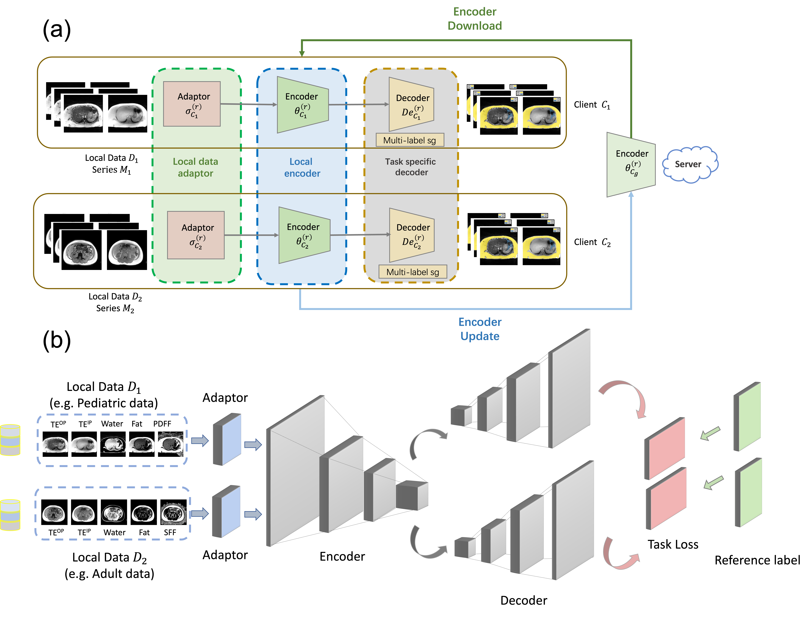

# Cross-Cohort Federated Learning for Pediatric Abdominal Adipose Tissue Segmentation and Quantification Using Free-Breathing 3D MRI

Author: Wenwen Zhang†, Sevgi Gokce Kafali†, Timothy Adamos, Kelsey Kuwahara, Ashley Dong, Jessica Li, Shu-Fu Shih, Timoteo Delgado-Esbenshade BA, Shilpy Chowdhury, Spencer Loong, Jeremy Moretz, Samuel R. Barnes, Zhaoping Li, Shahnaz Ghahremani, Kara L. Calkins, Holden H. Wu*

This is the implementation of the accepted radiology advances paper: Cross-Cohort Federated Learning for Pediatric Abdominal Adipose Tissue Segmentation and Quantification Using Free-Breathing 3D MRI.

Author: 




## Setup

```bash
pip install -r requirements.txt
```

## Dataset

This repository follows the nnU-Net raw data structure convention for organizing medical imaging datasets. Each dataset is stored in its own folder under the root directory ('nnUNet_raw')/.

```
nnUNet_raw/
│
├── DatasetID1/
│   ├── imagesTr/      # Training images
│   ├── imagesTs/      # Testing images
│   ├── labelsTr/      # Training labels
│   └── labelsTs/      # Testing labels 
│
└── DatasetID2/
    ├── imagesTr/
    ├── imagesTs/
    ├── labelsTr/
    └── labelsTs/
```

### Dataset organization

Each image and label pair must share the same base filename, with a ('_0000') channel suffix for multimodal/multicontrast data.
For example:
```
imagesTr/
    subject001_0000.nii.gz
labelsTr/
    subject001.nii.gz
```

If multiple contrasts exist (e.g., Out of phase, In phase), they should be indexed as:
```
subject001_0000.nii.gz  # Multicontrast 1
subject001_0001.nii.gz  # Multicontrast 2
...
```
### File Naming Convention
Each dataset folder should include a corresponding dataset.json file describing the dataset metadata, such as image contrasts, labels, and training/testing splits. Example:
```
{
  "name": "DatasetID1",
  "description": "Adipose tissue segmentation dataset",
  "channel_names": {
    "0": "Out of Phase"
  },
  "labels": {
    "background": "0",
    "adipose tissue": "1"
  },
  "file_ending": ".nii.gz",
  "numTraining": 100,
  "numTest": 20,
  "preset_validation": [
        "0001",
        "0002",
        "0003",
        "0004",
  ]
}
```

## Training

```bash
bash train.sh
```


## Citation
Please cite:
